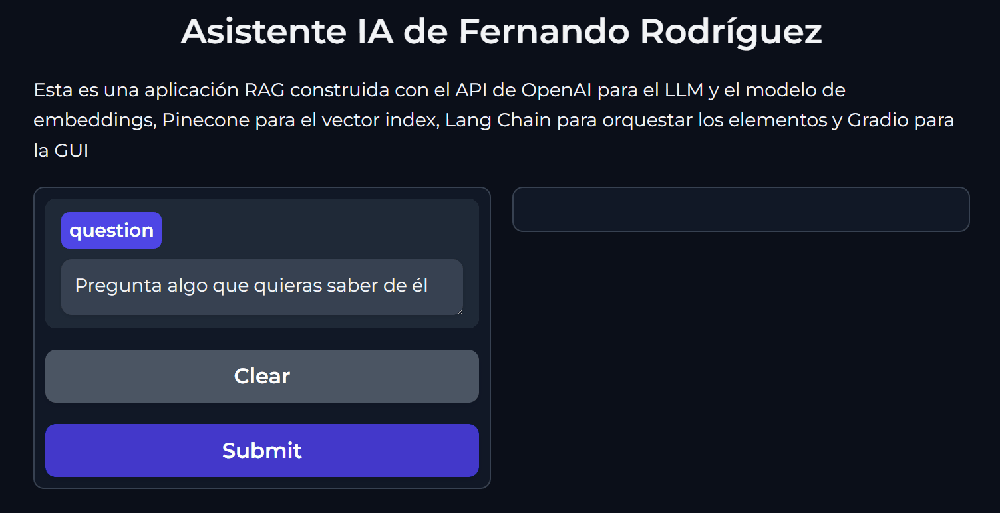
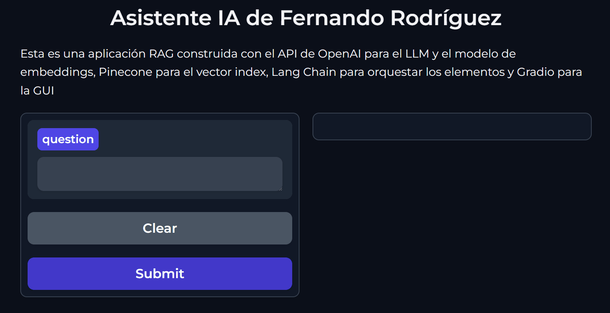

# Asistente CV

¿Qué tal si además de enviarle a un reclutador tu CV le mandas también el link de tu asistente IA para que le responda todas sus preguntas sobre tu perfil profesional? Con Asitente CV puedes crear un chatbot especializado en tu perfil profesional.

Esta es una aplicación RAG opensource construida con el API de OpenAI para el LLM y el modelo de embeddings, Pinecone para el vector index, Lang Chain para orquestar los elementos, Gradio para la GUI y todo desplegado en un space de HuggingFace.

## Demo

> Un reclutador pregunta algo sobre tu perfil profesional y el asistente responde solo si encuentra la información en tus documentos

> Si el reclutador pregunta algo que no está en tus documentos, el chatbot no alucina, responde que no sabe e invita a que te contacten para una entrevista.

## Implementalo sin escribir ni una línea de código

Hemos publicado un video de YouTube donde se detallan las instrucciones para que cualquier persona pueda implementar este proyecto:

 <a href="https://www.youtube.com/watch?v=nYBfLauP1SE">Tutorial</a>

---

Desarrollado en: <a href="https://agenticus.org/">Agenticus</a>

