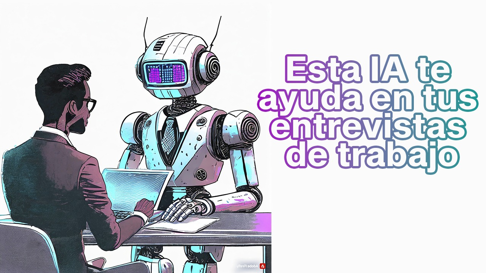

# Asistente CV

¿Qué tal si además de enviarle a un reclutador tu CV le mandas también el link de tu asistente IA para que le responda todas sus preguntas sobre tu perfil profesional? Con Asitente CV puedes crear un chatbot especializado en tu perfil profesional.

Esta es una aplicación RAG opensource construida con el API de OpenAI para el LLM y el modelo de embeddings, Pinecone para el vector index, Lang Chain para orquestar los elementos, Gradio para la GUI y todo desplegado en un space de HuggingFace.

## Demo

> Un reclutador pregunta algo sobre tu perfil profesional y el asistente responde solo si encuentra la información en tus documentos

> Si el reclutador pregunta algo que no está en tus documentos, el chatbot no alucina, responde que no sabe e invita a que te contacten para una entrevista.

## Implementalo sin escribir ni una línea de código

Hemos publicado un video de YouTube donde se detallan las instrucciones para que cualquier persona pueda implementar este proyecto:

 <a href="https://www.youtube.com/watch?v=nYBfLauP1SE">Tutorial</a>

## Descripción de las tecnologías utilizadas

1. extraemos el texto de tus documentos en formato PDF y lo partimos en pequeños pedazos conocidos como “chunks”.
2. Pasamos estos chunks por el modelo de embeddings de OpenAI. Este es un modelo de deep learning que convierte el texto en vectores numéricos. 
3. Esto da como resultado un conjunto de vectores que se conocen como embeddings.
4. Subimos estos embeddings de tus documentos a un vector index en Pinecone. PD. Estos 4 primeros pasos nos han servido para crear nuestra base de datos vectorial, así que solo necesitamos ejecutarlos una sola vez como verán más adelante en el video.
5. Luego, lo que va a pasar es que cuando un reclutador entre a tu asistente, va a hacer una consulta.
6. Esta consulta pasará por el mismo modelo de embedding que el paso 2.
7. El modelo convertirá la consulta en un embedding.
8. Ahora que la consulta se ha convertido en números, es posible hacer la búsqueda semántica
9. Se busca en la base de datos de Pinecone los párrafos que más se relacionan con lo consultado.
10. Se encuentra y extrae la información relevante.
11. Esta información es pasada como contexto al LLM, en este caso ChatGPT 3.5-turbo-1106 de OpenAI. Junto al contexto le pasamos la consulta del usuario.
12. El LLM genera una respuesta.
13. Finalmente, la respuestas es mostrada al reclutador mediante la GUI.
Importante mencionar que todo esto sucede en un entorno de ejecución montado en un space de Hugging Face y se muestra al usuario una interfaz gracias a Gradio. También nótese que los distintos elementos de esta aplicación pueden interactuar gracias a Langchain.

---

Desarrollado en: <a href="https://agenticus.org/">Agenticus</a>

